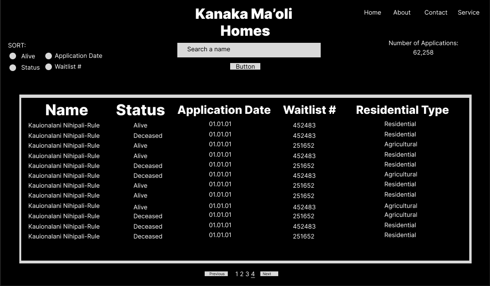

# Hawaiian-Homes-Tracker
The Hawaiian Homes Tracker is a user-friendly web application designed to streamline the management of the Department of Hawaiian Home Lands waitlist for native Hawaiian homestead applicants. Inspired by the Hawaiian Homes Commission Act, this project addresses the lack of accessible digital tools for tracking waitlist data. 

## Live demo link

## Tech Stack
Frontend: HTML, CSS, Javascript, Bootstrap, Axios
Backend: Mongoose, Mongodb Atlas, Express, nodemon, morgan

## Wire Frame

This homepage performs the HTTP 'GET' method, showcasing a search bar, sorting options with radio buttons, a list of names and details for Hawaiian home applicants, and pagination for navigation.

## Features

## Future Roadmap